关于电梯宣言和商业画布，最终的作业体现的是思考的结果。过程显得更加重要，想到了，理解了，学会了。

最开始的一版从自身痛点出发，抓住的是传统行业转行和对互联网模式下的知识体系与实践的这个点。

看完了同学们的作业，意识到还有另一类人群是应届生其实情况比较类似。但是还有“野路子”的产品经理呢？很难说他没有互联网的知识体系与实践。而互联网行业本身的知识体系也并不是一层不变的，为什么他们还需要学习呢？

联想到知群的口号里提到的Top10的互联网精英，课程无论是老师还是嘉宾均来自互联网大厂，所以可以归纳出结论知群希望传授的是一线互联网公司相对通用和认可的经验。这套体系经过了国内知名互联网公司的信任背书，所以这套课程体系本身的价值的关键点。

这也说明了为什么是知群而不是其他培训机构的关键因素。

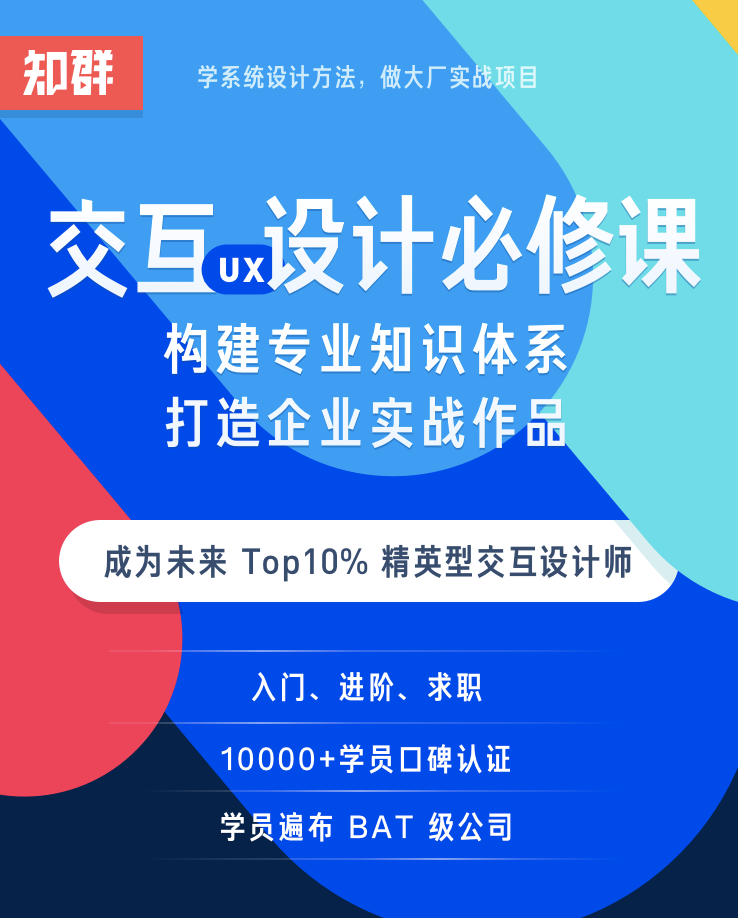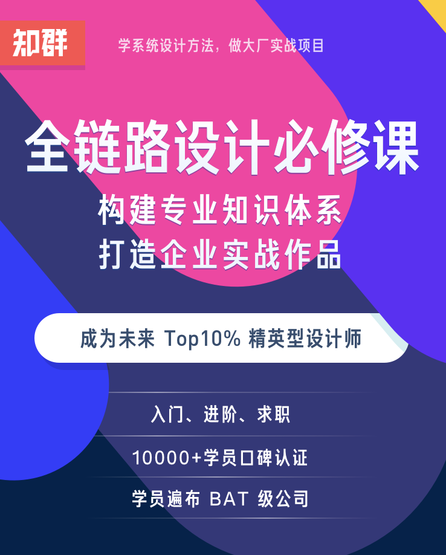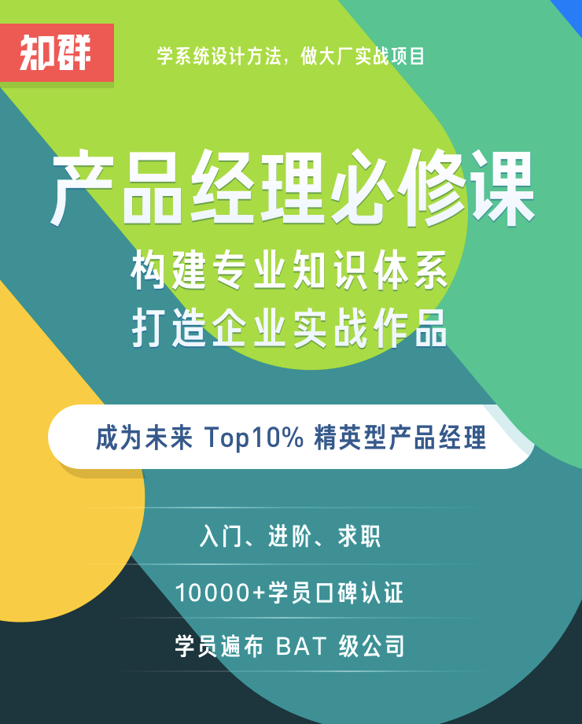
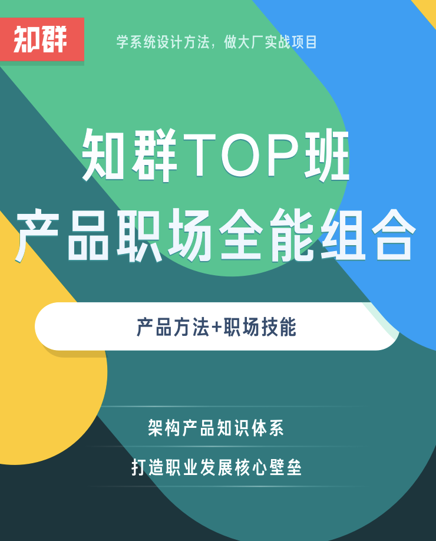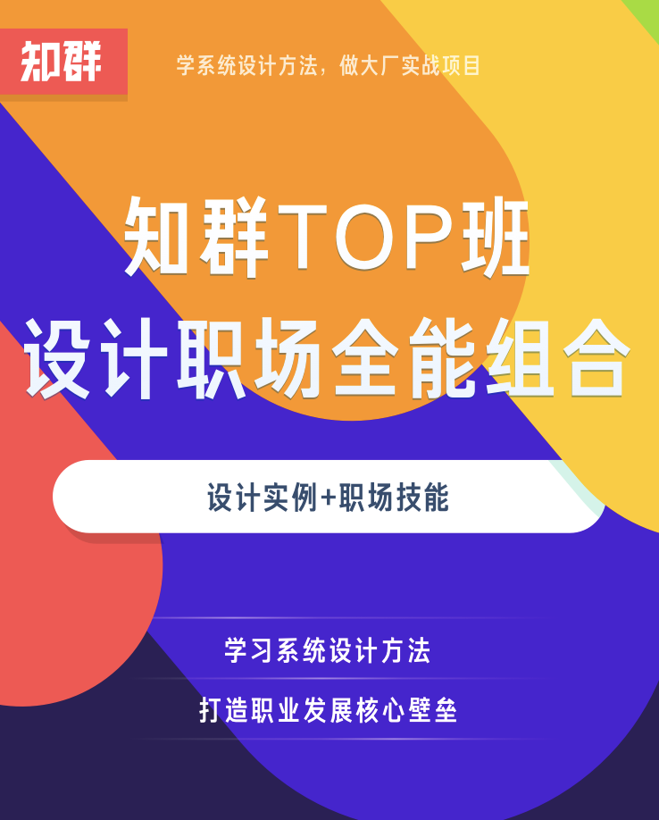
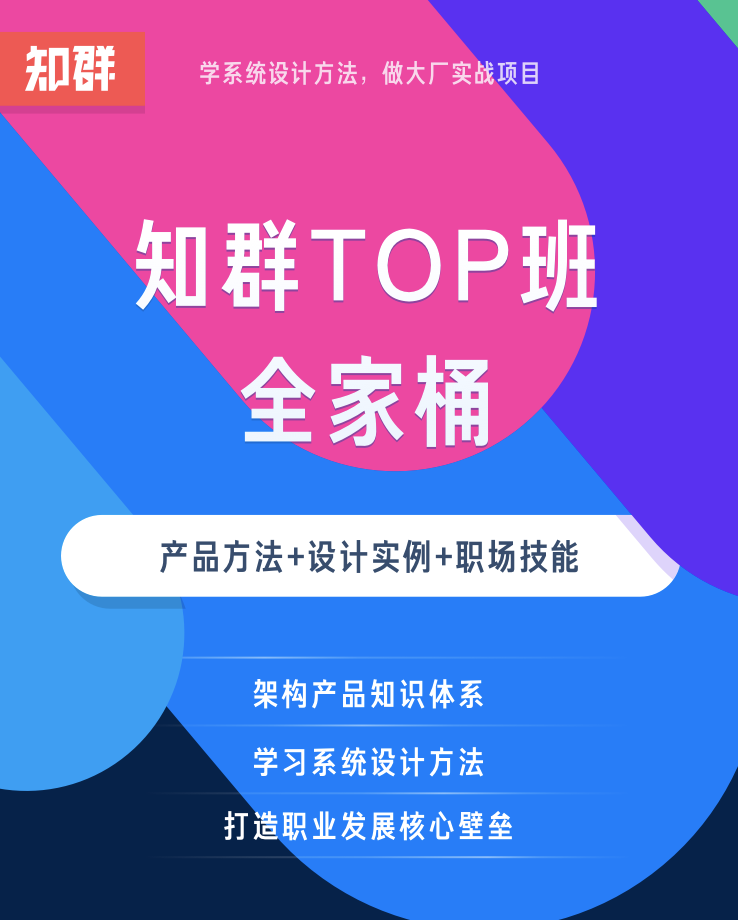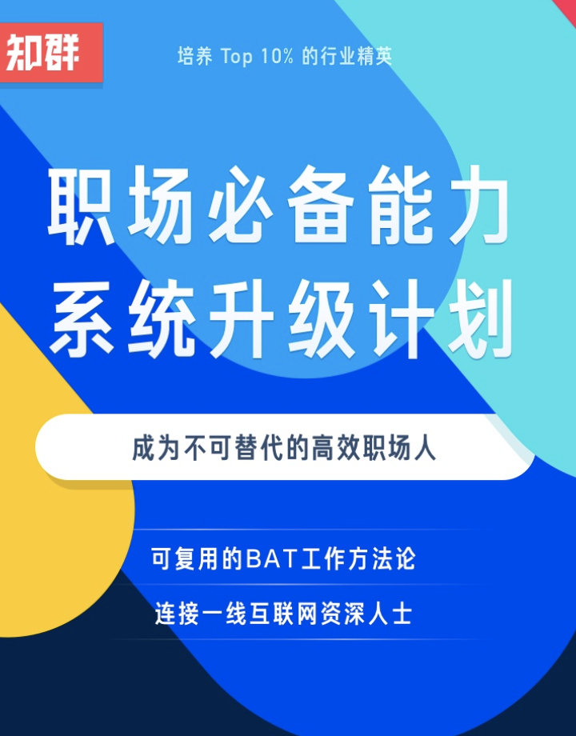

通过知群目前的课程介绍内容分析可以发现，核心价值和课程的内容已经实现了组块化（至少在宣传上）

“学系统设计方法，做大厂实战项目”
“构建专业知识体系，打造企业实战作品”
“成为未来Top10%精英型产品经理/（交互）设计师”
“入门、进阶、求职”
“10000+学员口碑认证”
“学员遍布BAT公司”

有几大模块呢
产品方法、设计实例、职场技能 分别对应 架构产品知识体系、学习系统设计方法、打造职业发展核心壁垒


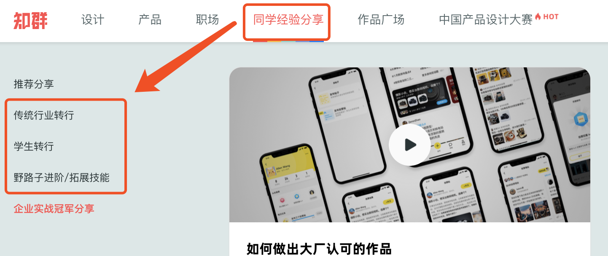

```
关于我们
知群设计圈属于知易时光（北京）科技有限公司旗下品牌。

知易时光（北京）科技有限公司是一家在线职业教育培训的互联网公司，致力于在新经济时代培养更多的实战型人才。公司自成立以来，持续与腾讯、阿里、网易、携程、知乎等一线互联网公司保持良好的合作关系，在业界的知名度不断扩大。

知群是赋能个人和企业的大学，我们的知群是培养TOP10%产品经理、设计师和职场人的教育社群，和腾讯、阿里、携程、知乎等多家知名企业和产品合作，帮助

（1）零基础的学生入行；

（2）传统行业转行进入互联网；

（3）工作1-5年野路子的产品经理和设计师提升。

很多优秀的人通过在知群的学习，跨入了互联网岗位的门槛，其中有不少人甚至拿到了阿里、腾讯等的 Offer，我们在陆续邀请知群的同学来分享自己的学习经验。我们将各个行业有一技之长的人们连结在一起，包括200+知名企业和3000+资深互联网人士，帮助个人提升专业能力的同时，让知群的同学们能结识合适的人，发现更大的世界。
```
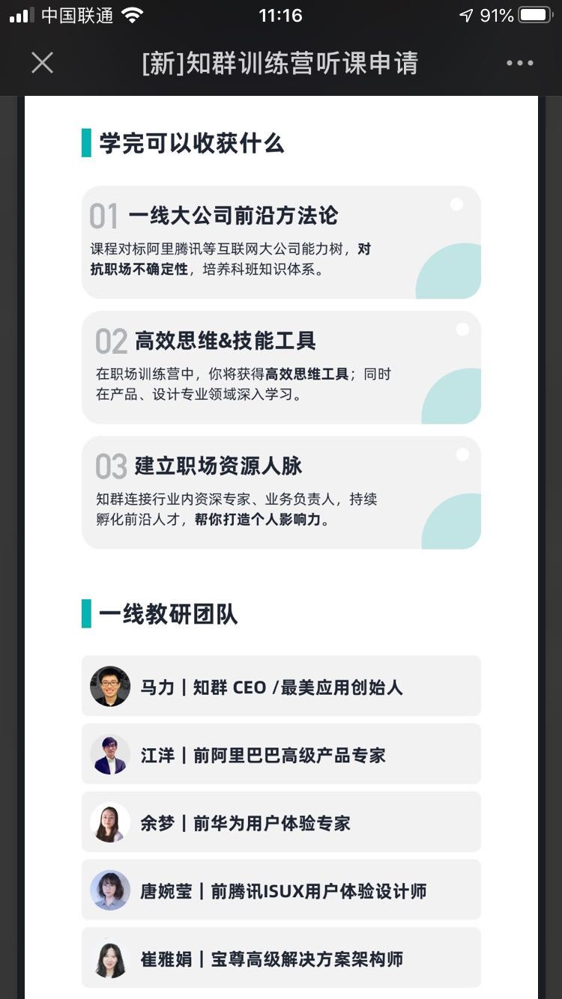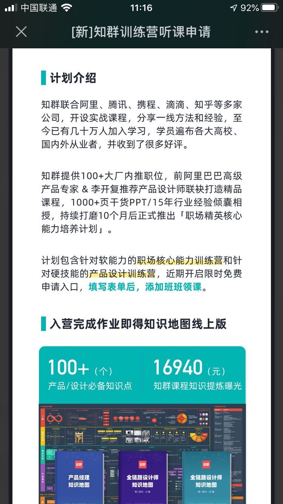


面向人群：零基础的学生入行、传统行业转行进入互联网、工作1-5年野路子的产品经理和设计师提升


竞品的情况呢
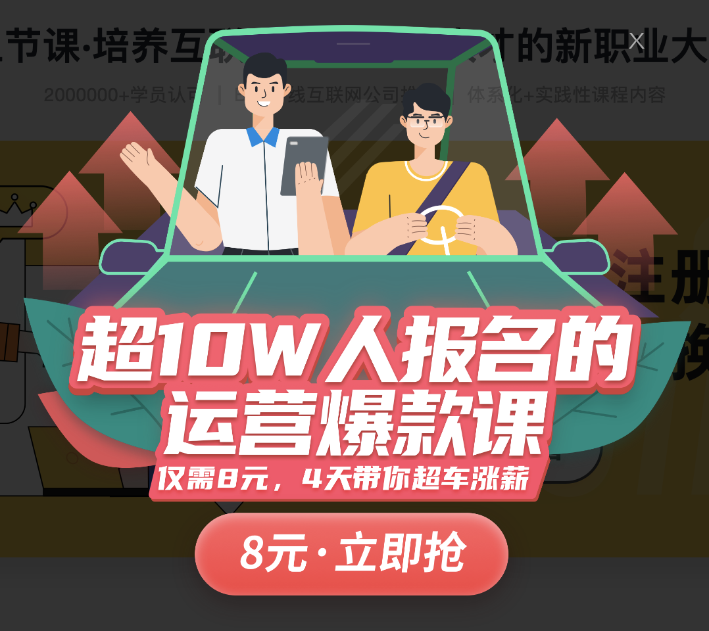


### 如何来自作业，又超越作业的探索
基于作业做探索
过程中发散、思考、总结
最后回到作业，提交作业
总结输出，形成自己的理解，超越作业

最核心的是，尼尔森可用性工程+阿兰库珀的「UCD」理论核心，结合我们教研团队在互联网行业中20年左右的这种实战经验而形成的一系列理论体系，并且整合了近十年左右行业中通用的一些方法论

