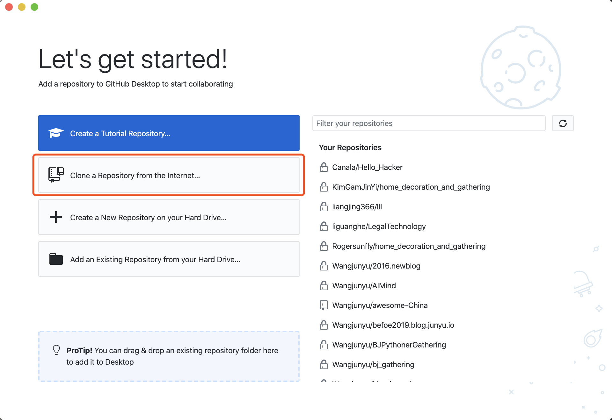
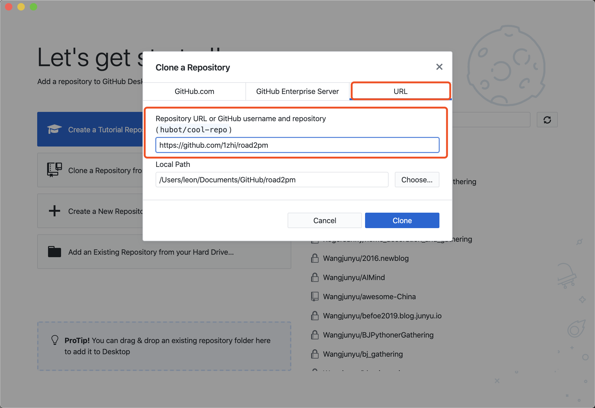
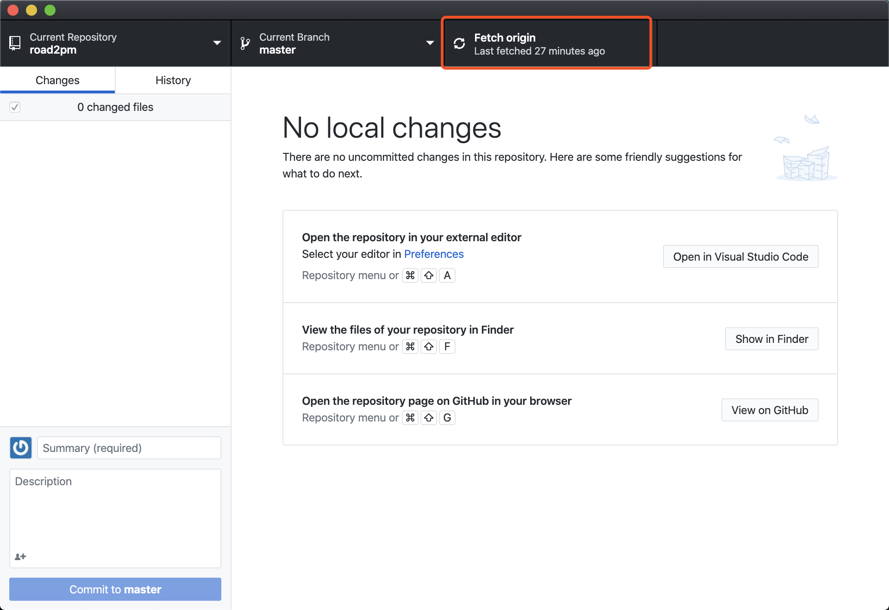
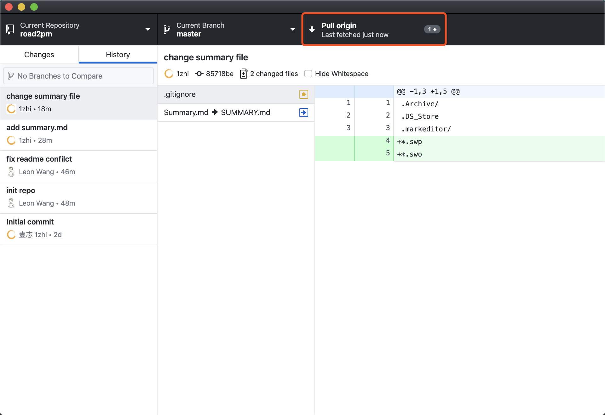
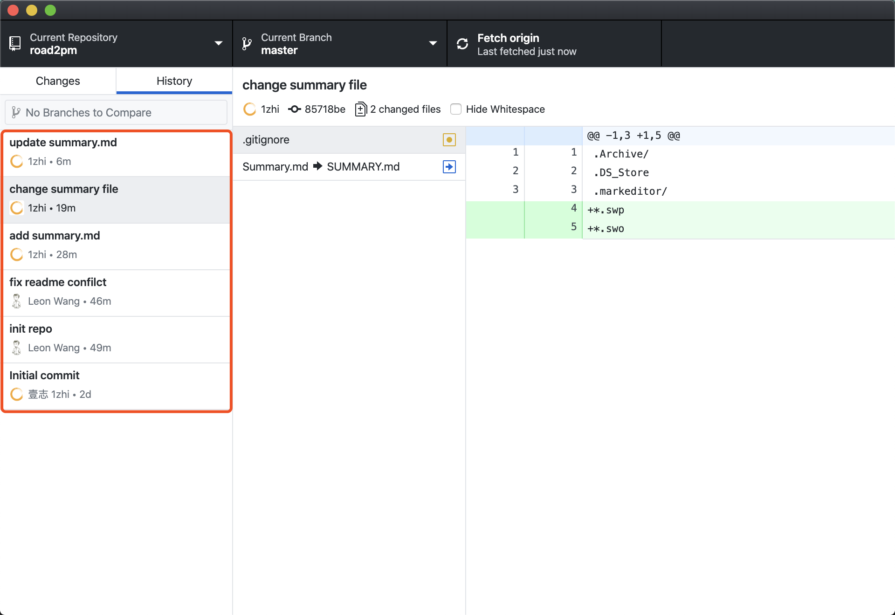
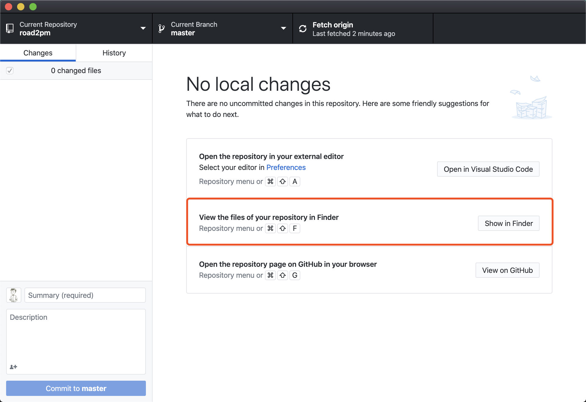

# Github 桌面客户端的使用说明
Github 是优秀的代码管理和工作协同工具，作为产品经理，如果想和开发者一起工作，了解 Github 的使用是加分项。

## 初始化仓库
下载 Github 客户端后，选择克隆一个仓库，即下方红框选项。

克隆仓库时选择 URL，输入仓库链接，以该仓库为例：https://github.com/1zhi/road2pm

一般来说完成上面的两步，仓库就已经完成了基本的连接。

## 获取仓库内容的更新

点击如下红框的内容：会获取目前仓库里最新的变化到本地

如果内容有变化，会看到刚才点击的“Fetch Origin”处变成了“Pull origin”，点击后即可获取相关内容到本地。

在下图红框处可以查看相关的变化的内容，点击后右侧会看到变化的具体内容

## 在本地做内容的增补和修改

点击下方红框的位置，可以找到仓库内容在本地的位置，可以愉快的编辑你想编辑的内容了

## 如何找到文件
@33 等你来补充

## 如何打开Markdown文件

* Windows：用记事本可以打开先用着、sublime、Typora等
* MacOs ：推荐Markeditor，当然还有许多其他的工具，自己找找看
* Linux 及其他：相信你肯定可以找到办法
