# 疫情之后，产品经理竞争加剧

疫情之后，社会整体招聘竞争程度增加，互联网行业也不例外，特别是一线城市的互联网经理们，建议从产品设计与管理、需求调研与分析、项目管理等几个产品经理的关键技能点做针对性的学习与实践，增加市场核心竞争力。

## 疫情之后，整体就业形势严峻

基于下图「季度求职申请人数、招聘需求人数和 CIER 指数的变化趋势」可见，2020 年第一季度和第二季度在往年的一季度季节性 CIER 指数下降的基础上进一步下降。
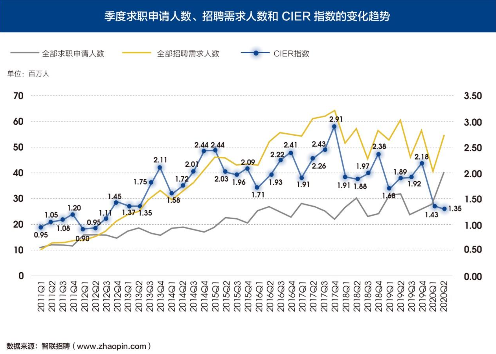
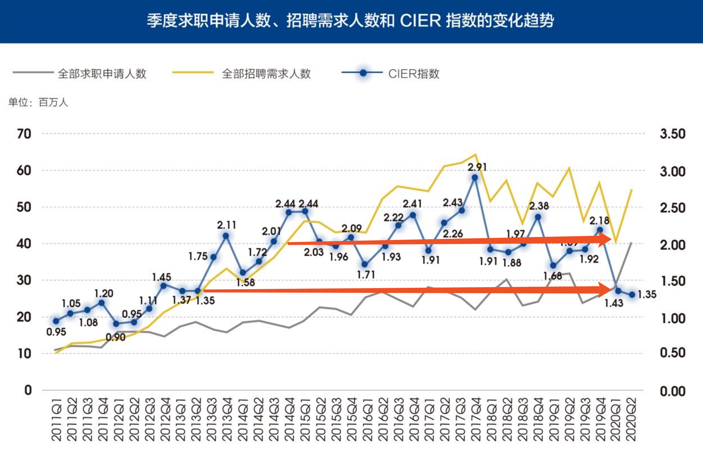

和历年数据对比会发现，在 2020 年 Q1 的招聘需求人数也降到 2014 年 Q4 季度的水平，虽然 Q2 开始剧烈反弹，同时求职申请人数也创下历史新高，而 CIER 指数下降到了 2013 年左右，从绝对数据上比较，远超过了 2018 年所谓互联网寒冬的就业困难程度。

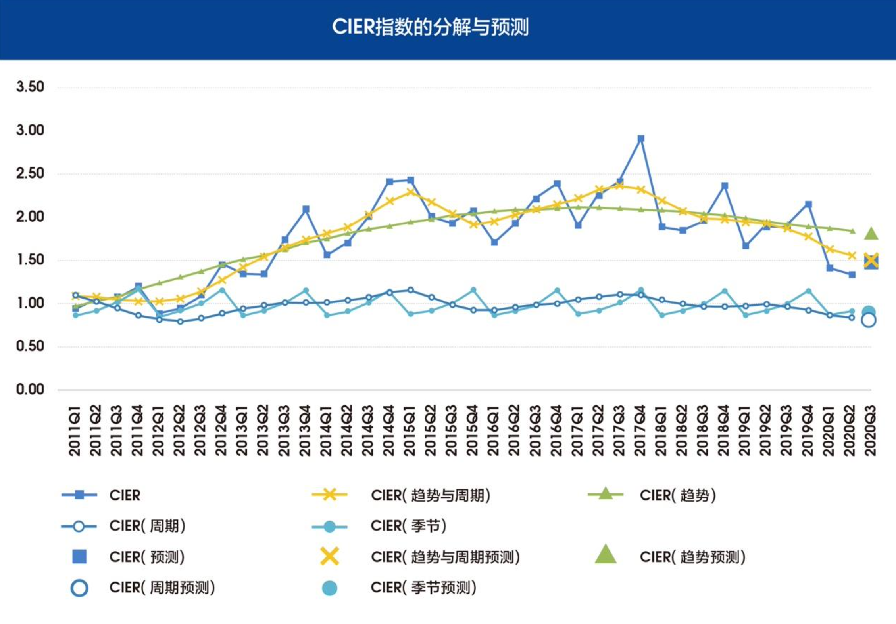

从预测的 CIER 数据可见，未来一个季度内 CIER 值会继续下降，同比下降，环比上升，即和去年同期比较竞争依然激烈，但和疫情期间比较有所好转。

## 互联网行业的产品经理，喜忧参半

从 CIER 指数在全行业的数据比例来看，互联网行业整体就业形势相对较好。但依然是同比竞争劲烈，环比优于疫情初期。
>互联网/电子商务招聘需求人数增幅 相对较大，且大于求职申请人数的增幅，CIER 指数环比回升。特别是娱乐/体 育/休闲行业，受直播/主播等线上活动带动，本季度招聘需求人数环比增加 117.82%，远大于求职申请人数增幅，CIER 指数上升明显。
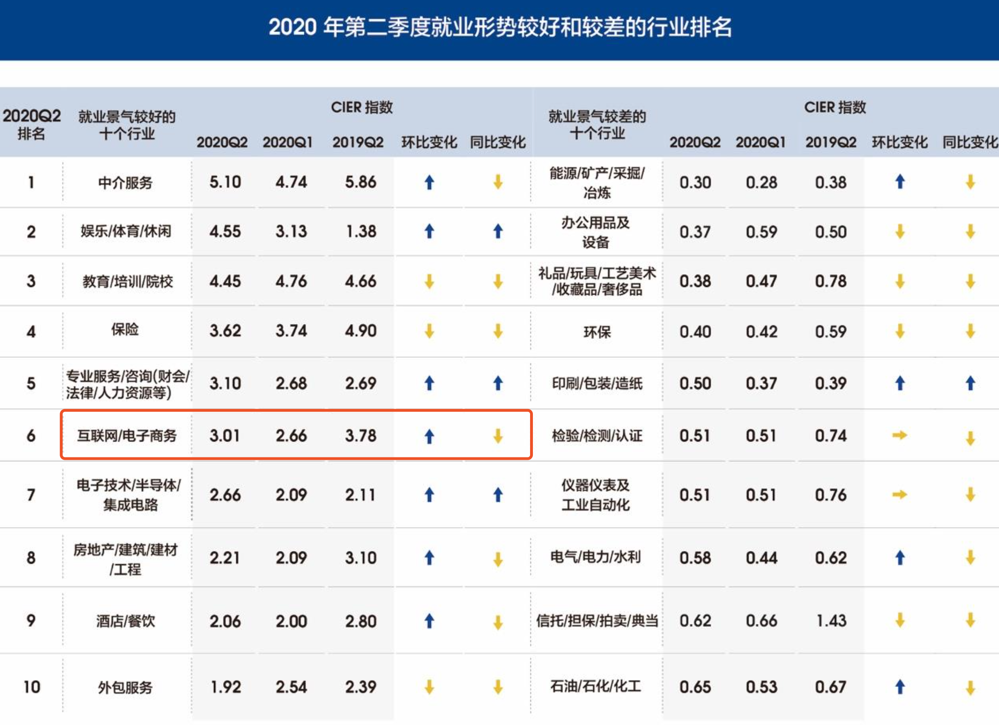
从职业的角度 CIER 指数较低的职业主要仍为 IT 管理/项目协调、采购/贸易、高级管理、 销售行政/商务和项目管理/项目协调等。与上季度相比，IT 管理/项目协调、采 购/贸易和高级管理等职业招聘需求人数减少幅度大于求职申请人数，CIER 指数 下降。
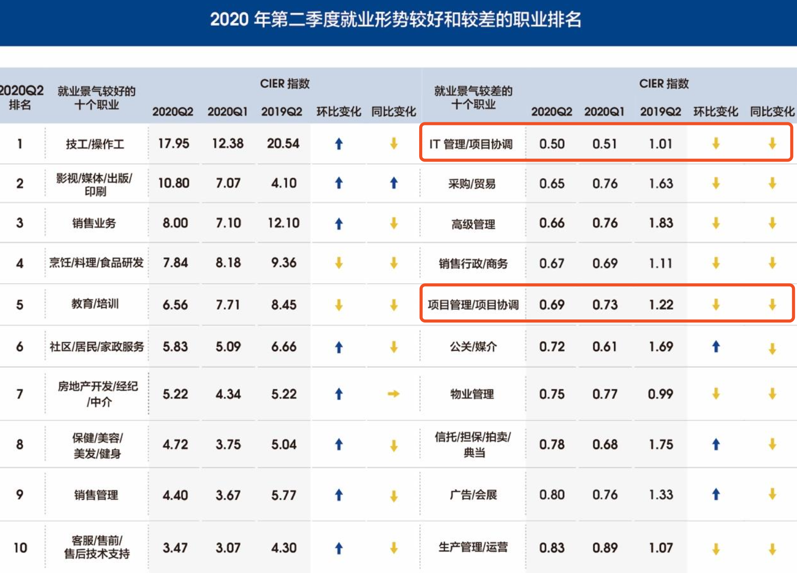
## 大趋势下地域差异较为明显
结合下方的图示内容分析发现，一线城市（北上广深）竞争非常激烈，但是如果在长三角或者珠三角地区避开北上广深后，其他城市的机会竞争压力相对小很多。
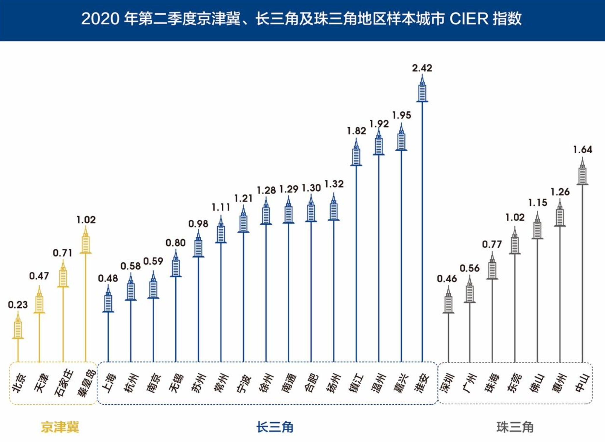
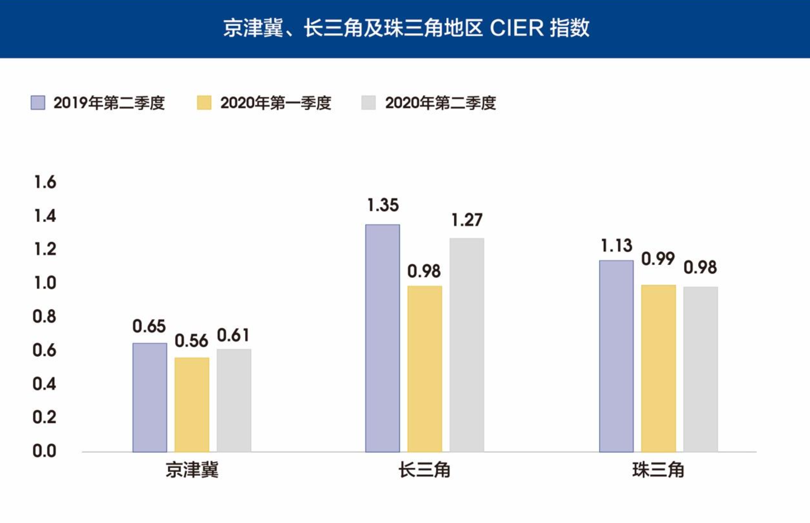
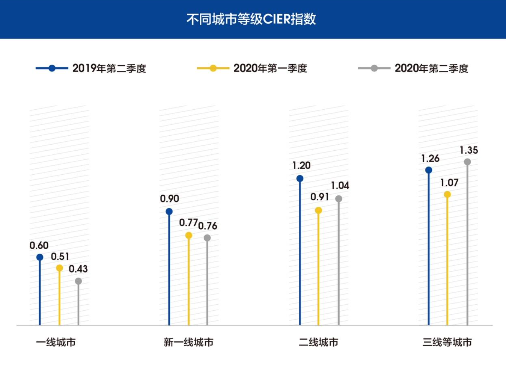

结合下图可知，对于在北京工作的产品经理们，无论是哪一个年龄段，如果要找工作，需要有充分的思想准备。
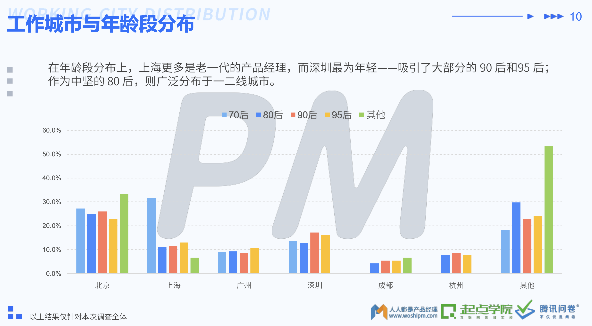
## 不同阶段的产品经理需要做好准备

由于竞争的加大，产品经理需要在核心技能方面进行强化训练与实践，以便在需要换工作时更具有优势。
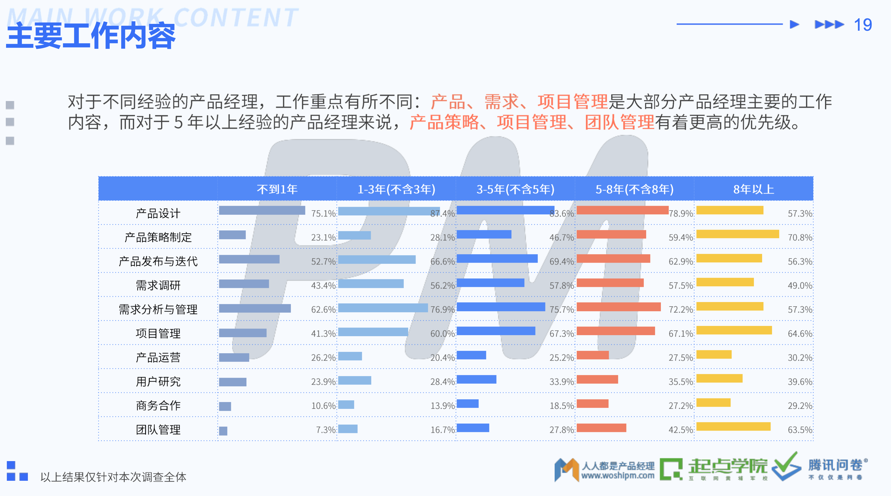
## 疫情带来的互联网使用习惯的改变

从以下数据可以发现，疫情在职位上带来了短期的竞争压力，但同时也增加了互联网应用融入日常生活的机会，各类互联网应用（除了外卖、旅行、网约车等受到疫情影响有所衰退外）均获得了用户规模和使用率的增长。从长远来看，这是产品经理的利好消息，未来有可能带来更多的职业机会。

截至 2020 年 3 月，我国网民规模为 9.04 亿，较 2018 年底新增网民 7508 万，互联网普及率达 64.5%，较 2018 年底提升 4.9 个百分点。
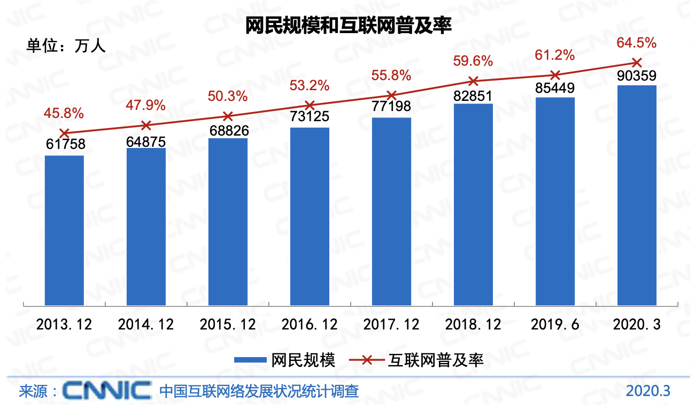

而从互联网应用的用户使用率来看，除了外卖、旅行、网约车等受到疫情影响有所衰退外，其他的相关应用均获得使用率的增加。
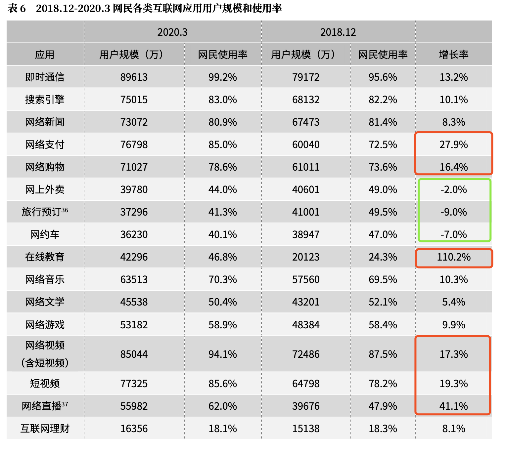
手机端的使用增长情况更加明显。
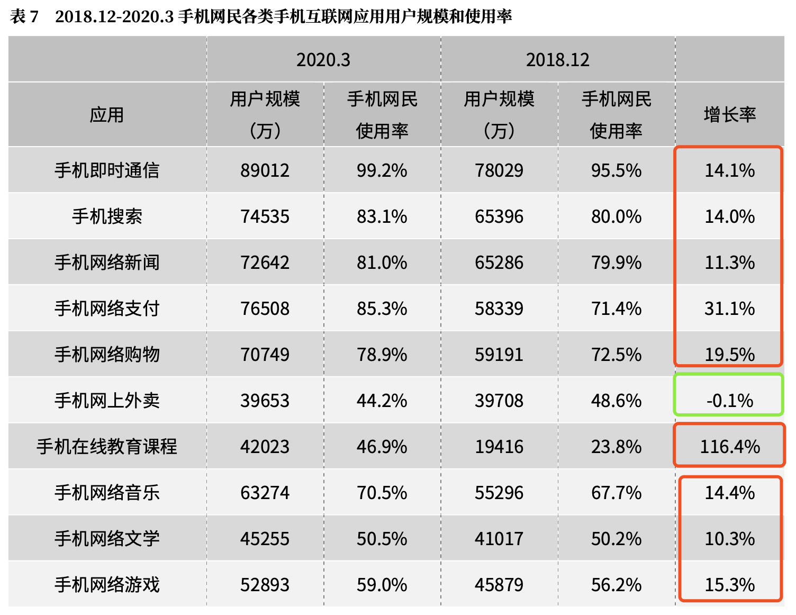

虽然疫情带来了短期的竞争压力，但是从长远来看，互联网产品经理的岗位会因为整个社会对互联网的依赖程度，伴随行业的发展得到新的发展机会。

## 附录：数据说明

### CIER 指数与中国就业研究所
CIER 指数为市场求职申请人数与市场招聘需求人数之比值（CIER指数=求职申请人数/招聘需求人数），直观意义为：职业市场上平均多少个求职者竞争一个招聘需求岗位。该数据为[中国就业研究所](http://www.cier.org.cn/)与智联招聘联合发布，来自[2020年第二季度《中国就业市场景气报告》 ](http://www.cier.org.cn/ShowPaper.asp?ID=295)。

### 第45次《中国互联网络发展状况统计报告》
该报告来自[中国互联网络信息中心](http://www.cac.gov.cn/2020-04/27/c_1589535470378587.htm)。

### 2019 产品经理生存报告
2019 产品经理生存报告[地址](http://www.woshipm.com/it/3236530.html)，由人人都是产品经理、起点学院、腾讯问卷联合发布。
